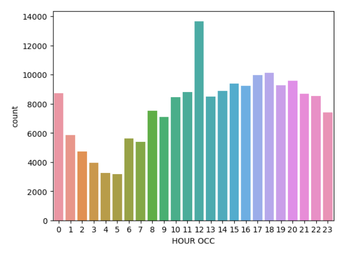
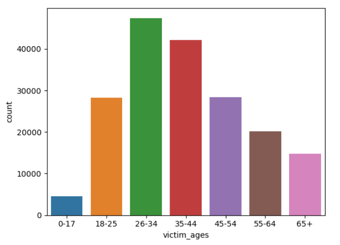
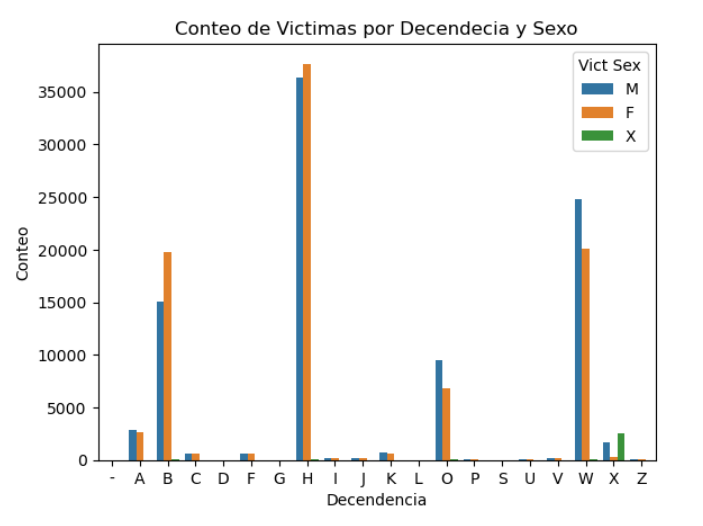

# Analizando la taza de actividad criminal en los angeles

## Los Ángeles, California 😎. La Ciudad de los Ángeles. Pueblo de oropel. ¡La capital mundial del entretenimiento!

Conocido por su clima cálido, palmeras, extensa costa y Hollywood, además de producir algunas de las películas y canciones más emblemáticas. Sin embargo, como ocurre con cualquier ciudad densamente poblada, no siempre es glamorosa y puede haber un gran volumen de delincuencia. ¡Ahí es donde puedes ayudar!

Se le ha pedido que apoye al Departamento de Policía de Los Ángeles (LAPD) analizando datos sobre delitos para identificar patrones de comportamiento delictivo. Planean utilizar sus conocimientos para asignar recursos de manera efectiva para abordar diversos delitos en diferentes áreas.

## Los datos
Le han proporcionado un único conjunto de datos para utilizar. A continuación se proporciona un resumen y una vista previa.

Es una versión modificada de los datos originales, que está disponible públicamente en Los Angeles Open Data.

## Concluciones 
### ¿Qué hora tiene la mayor frecuencia de delitos en los Angeles?

Respuesta: Es mas probable sufrir de algun crimen en LA  a MEDIO DIA!!!

### ¿Qué zona tiene la mayor frecuencia de delitos nocturnos (delitos cometidos entre las 10 de la noche y las 3:59 de la madrugada)?

Respuesta: La zona menos recomendable para diambular en la noche es la zona centro de LA

###  Identificando el número de delitos cometidos contra víctimas de diferentes grupos de edad

Respuesta: Las personas entre 26 y 34 años sulen sufrir mas delitos en la ciudad

### Genero y origen de la gente que mas sule sufir crimen en los angeles 

Respuesta: La gente de origen hispano suele ser los que mas sufren del crimen, seguido por los afro-americanos y depues los blancos. Tiene sentido, debido a que LA es la segunda ciudad con mas hispanos en el mundo, despues de la CDMX.
